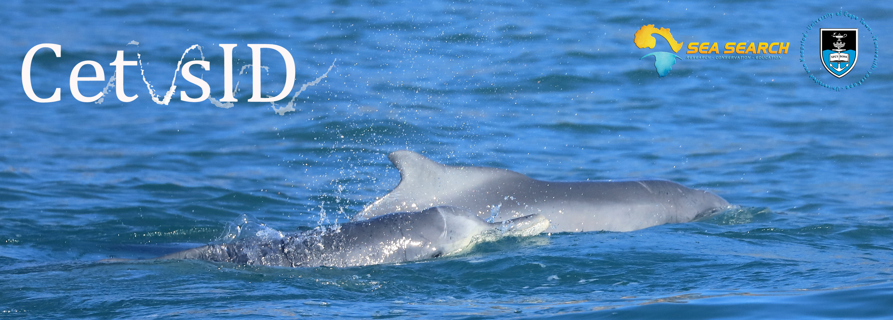
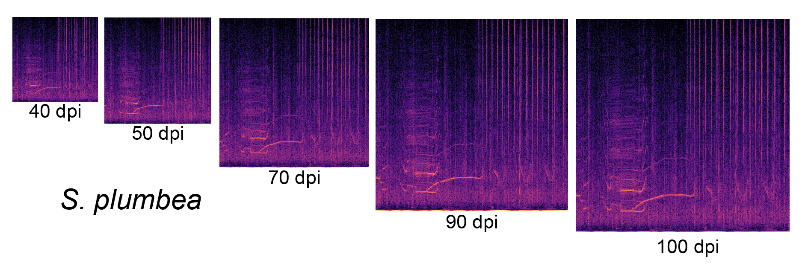

# Automatic Detection and Taxonomic Identification of Dolphin Vocalizations using Convolutional Neural Networks for Passive Acoustic Monitoring
## Purpose of the project
We assessed the applicability of Convolutional Neural Networks (CNNs) for dolphin monitoring in long-term recordings using their complete vocal repertoire along with a model prediction and post-processing approach for automated taxonomic identification. The proposed framework designed here combining biological knowledge on sound production in dolphins and innovative machine learning tools may enhance the use of passive acoustic monitoring for target species in highly diverse areas. The algorithm was designed to easily fine-tune classification tasks of biological sounds and may increase the use of CNNs through a near-friendly, Linux interface. The open-source application presented here advances the research in improving the detection and identification of dolphin vocalizations in audio recordings and will be valuable for monitoring the endangered Indian Ocean humpback dolphin (*Sousa plumbea*) in South African waters.

## Authors
Guilherme Frainer* [1, 2], Emmanuel Dufourq [3, 4, 5], Jack Fearey [1, 2], Sasha Dines [2, 6], Rachel Probert [2,7], Simon Elwen [2, 6], Tess Gridley [2, 6]

[1] Centre for Statistics in Ecology, Environment and Conservation, University of Cape Town, South Africa. 
[2] Sea Search Research and Conservation, South Africa. 
[3] African Institute for Mathematical Sciences, South Africa. 
[4] Department of Applied Mathematics, Stellenbosch University, South Africa; 
[5] National Institute for Theoretical and Computational Sciences, South Africa
[6] Department of Botany and Zoology, Stellenbosch University, South Africa. 
[7] School of Life Sciences, University of KwaZulu-Natal, South Africa.

## Open source data
A subset of the acoustic recordings used for the demonstration notebook, including labels for the acoustic data used for training, as well as the testing dataset with confirmed species identification has been stored in Zenodo and can be accessed at DOI:https://doi.org/10.5281/zenodo.8074949.

## Findings
The best performing models for the detection of dolphin presence and species identification used segments (spectral windows) of two second lengths (Fig. 1) and were trained using images with 70 and 90 dpi (Fig. 2), respectively. 

**Fig 1** Examples of spectrograms showing calls of all four species studied here built with distinct window sizes (two-, three-, five- and seven-seconds length).

**Fig 2** Indian Ocean humpback dolphin (Sousa plumbea) vocalizations captured in a single two second window length segment and converted to a linear spectrogram in images with distinct dots per inch (dpi). 

The best detection model was built using a customised architecture and achieved an accuracy of 84.4% for all dolphin vocalizations on the test set, and 89.5% for sounds with signal-to-noise ratio higher than 1. The best identification model was also built using the customised architecture and correctly identified *S. plumbea* (96.9%), *T. aduncus* (100%), and *D. delphis* (78%) (Fig. 3) encounters in the testing dataset. The developed framework assists in finding suitable CNN hyper-parameters for classification tasks on complex dolphin sounds and can be easily adapted for other species or populations.

**Fig 3** Comparison of confusion matrices for a four-class (left) and a three-class (right) species identification model applied to the testing, unseen dataset. 
